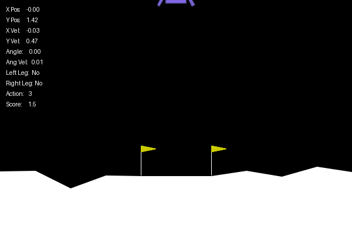
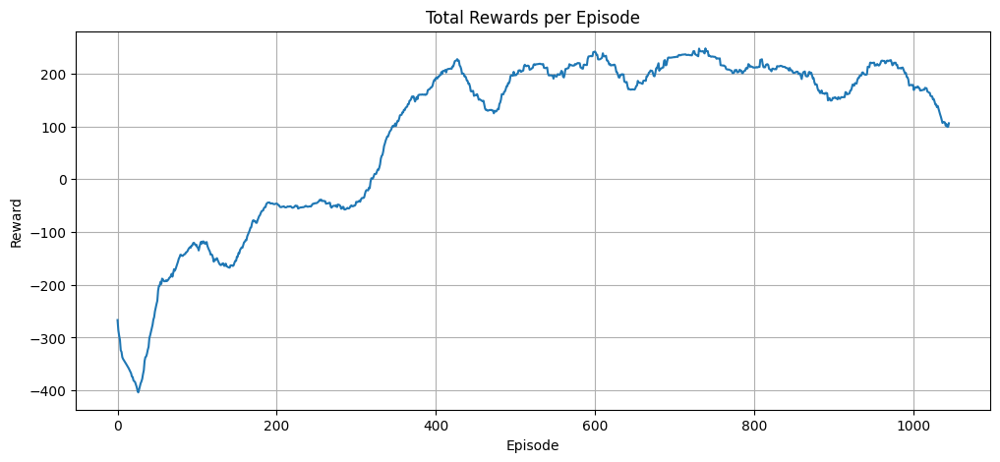
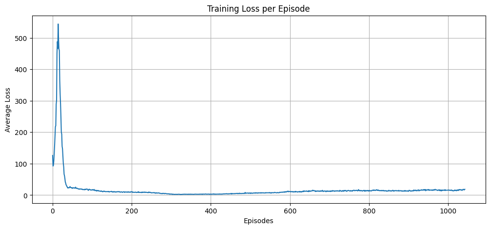

# 🛰️ Lunar Lander DQN

This project implements a Deep Q-Network (DQN) agent to solve the [Lunar Lander](https://gymnasium.farama.org/environments/box2d/lunar_lander/) environment from the Gymnasium library. It was developed as part of my MSc Data Science & AI at the University of Liverpool. The agent learns to land a spacecraft safely using reinforcement learning techniques.

---

## 🎮 Agent Demo



---

## 📊 Training Performance

### 🚀 Reward per Episode

<div align="center">
  
</div>

### 📉 Average Loss per Episode

<div align="center">
  
</div>

---

## 🧠 Approach

- **Algorithm**: Deep Q-Network (DQN)  
- **Exploration Strategy**: ε-greedy with decay  
- **Stabilization Techniques**: Experience Replay, Target Network  
- **Frameworks**: PyTorch, Gymnasium  

---

## 🗂️ Project Structure

```
Lunar-Lander-DQN/
├── Lunar_Lander_DQN.ipynb # Main notebook with training & evaluation
├── plots/
│ ├── rewards_for_1000_training_episodes.png # Reward visualization
│ └── training_loss_for_1000_episodes.png # Loss visualization
├── media/
│ └── lunar_lander_agent.gif # Agent demo GIF
├── README.md # Project overview
```

---

## ⚠️ License

This project is protected by copyright.

You may **not** copy, reuse, modify, or distribute any part of this code, notebook, or visual materials without **explicit written permission** from the author.

© Devarshi Choudhury, University of Liverpool, 2025.

